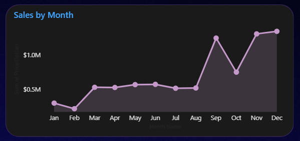
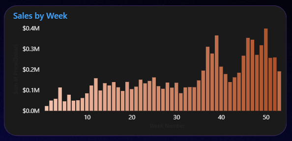
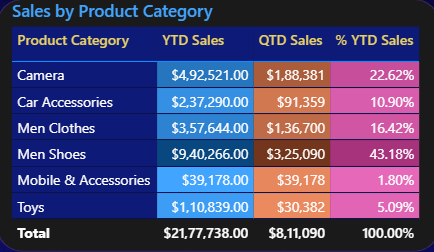
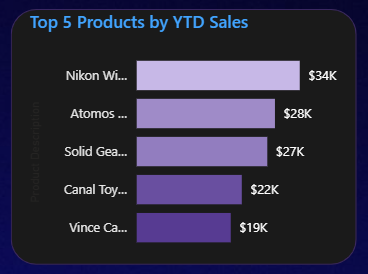
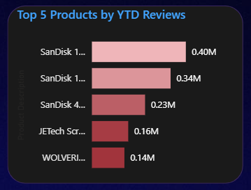

# amazon-products-sales-analytics
Interactive Power BI dashboard analyzing Amazon product sales, category performance, monthly and weekly sales trends, top-performing products, and customer reviews.

# 🛒 Amazon Products Sales Analysis Dashboard

## 📊 Project Overview

This project presents an interactive Amazon Products Sales Analysis Dashboard built using Microsoft Power BI.

The dashboard analyzes product sales data to provide insights into sales performance, product categories, sales trends, top-performing products, and customer review activity.

The report provides a comprehensive overview of sales performance through interactive visualizations, KPI cards, category comparisons, and product rankings.

---

## 🎯 Business Objective

The objective of this project is to analyze Amazon product sales data and provide insights into:

* Overall sales performance
* Year-to-date and quarter-to-date sales
* Product category performance
* Monthly and weekly sales trends
* Top-performing products by sales
* Products with the highest customer review counts
* Product sales contribution by category
* Sales performance across different periods

---

## 🔎 Key Business Questions

The dashboard was designed to answer questions such as:

* What are the overall year-to-date and quarter-to-date sales?
* How many products have been sold?
* How does sales performance change month over month?
* What are the weekly sales patterns?
* Which product categories generate the highest sales?
* Which categories contribute the most to overall sales?
* What are the top five products based on year-to-date sales?
* Which products receive the highest number of customer reviews?
* How does sales performance vary across different quarters?
* What patterns can be identified in product sales trends?

---

## 📌 Key KPIs

The dashboard provides the following key performance indicators:

| KPI | Value |
|---|---:|
| YTD Sales | Approximately $2.18M |
| QTD Sales | $811.09K |
| YTD Products Sold | 27.75K |
| YTD Reviews | 19.42M |

---

## 📈 Dashboard Analysis

### 1. Monthly Sales Analysis

The monthly sales analysis visualizes sales trends across the year using a line chart.

It includes:

* Monthly sales performance
* Month-over-month sales variations
* Identification of high and low sales months
* Comparison of sales patterns across the year

### 2. Weekly Sales Analysis

The weekly sales analysis provides a more detailed view of sales fluctuations over individual weeks.

It includes:

* Weekly sales performance
* Sales variations across weeks
* Identification of peak sales periods
* Comparison of weekly sales patterns

### 3. Product Category Analysis

The category analysis compares sales performance across different product categories.

It includes:

* YTD sales by product category
* QTD sales by product category
* Percentage contribution to YTD sales
* Category-wise performance comparison

The categories include Camera, Car Accessories, Men Clothes, Men Shoes, Mobile & Accessories, and Toys.

### 4. Top 5 Products by YTD Sales

This analysis identifies the five highest-performing products based on year-to-date sales.

It includes:

* Product-level sales ranking
* Comparison of sales generated by top products
* Identification of products contributing significantly to sales

### 5. Top 5 Products by YTD Reviews

This analysis highlights the five products with the highest year-to-date customer review counts.

It includes:

* Product review ranking
* Comparison of review counts
* Identification of products with high customer engagement

---

## 💡 Key Insights

### Product Category Performance

Men Shoes recorded the highest sales among the displayed product categories, with approximately $9.40M in YTD sales in the category comparison table.

Mobile & Accessories and Men Clothes also showed substantial sales contributions.

### Monthly Sales Trends

Monthly sales varied throughout the year, with noticeable increases during September and November, followed by strong sales in December.

### Weekly Sales Performance

Weekly sales fluctuated across the reporting period, with several noticeable peaks toward the later weeks.

### Top-Performing Products

The top five products by YTD sales were ranked based on their contribution to overall sales, helping identify leading products.

### Customer Review Activity

The top five products by YTD reviews provide an overview of products generating the highest customer review activity.

---

## 📊 Power BI Features Used

* KPI cards
* Line charts
* Column charts
* Horizontal bar charts
* Tables
* Interactive slicers
* Product category filtering
* Quarter filtering
* Top N product analysis
* Time-based sales analysis
* Conditional formatting
* Cross-filtering and visual interactions
* Custom dashboard layout and theme

---

## 🛠️ Tools & Technologies

* **Microsoft Power BI**
* **Power Query**
* **DAX (Data Analysis Expressions)**
* Data cleaning and transformation
* Data visualization
* KPI development
* Interactive dashboards
* Sales and product performance analysis

---

## 👤 Project Type

**Data Analytics / Business Intelligence**

**Domain:** E-commerce / Retail Analytics

**Primary Tool:** Microsoft Power BI
